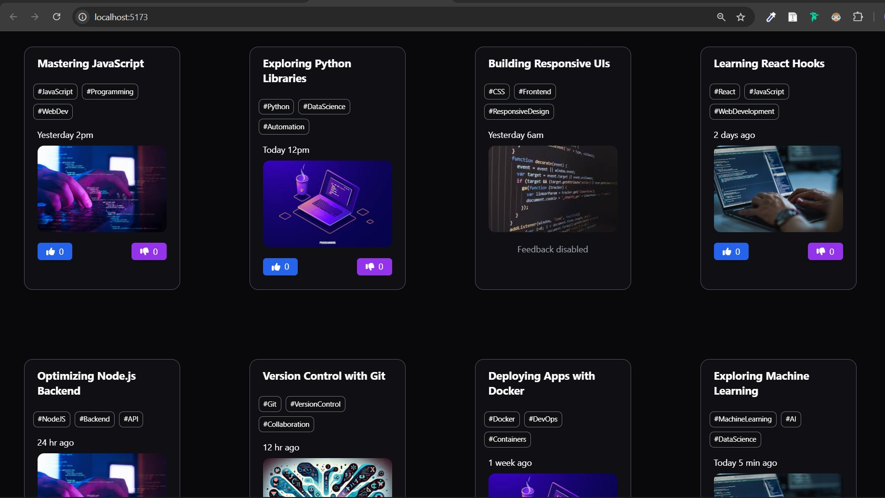

Here's a simple README for your project:

---

# Simple Reusable Card Component

This is a **React** and **Tailwind CSS** based reusable card component where users can upvote or downvote. Each card features a unique heading, background image, and relevant hashtags.

## Features

- **Upvote and Downvote:** Users can increase or decrease the vote count with buttons.
- **Dynamic Hashtags:** Each card displays unique hashtags related to coding.
- **Profile Image:** Option to display a profile image on each card.
- **Background Image:** Each card has a different background image, enhancing the visual appeal.
- **Responsive Design:** Styled using **Tailwind CSS**, making the cards responsive and visually appealing on different screen sizes.

## Card Preview

Here is a screenshot of the final card component:



## Usage

Each card displays the following:

- **Heading:** Displays a title for the card (e.g., “Mastering JavaScript”).
- **Hashtags:** Each card includes multiple tags relevant to the topic (e.g., `#JavaScript`, `#WebDev`).
- **Profile Image:** Option to show a profile image in a circular frame.
- **Background Image:** Cards have visually distinct background images.

## Example

```jsx
<Card 
  className="bg-zinc-600 border-teal-50"
  heading="Mastering JavaScript"
  profileImage="https://example.com/profile1.jpg"
  hashtags={['JavaScript', 'WebDev', 'Programming']}
  bgImage="https://example.com/javascript.jpg"
/>
```

